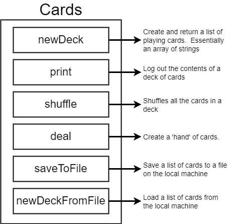
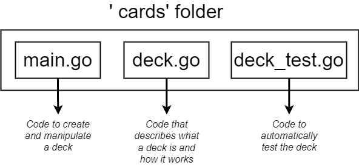

# Cards Project

## Project Structure







## Go more in depth

```go
var card string = "Ace of Spades"
```

* **var**: we’re about to create a new variable;
* **card**: the name of the variable
* **string**: type of the new variable (Go is a static type language). In this case can be omitted; it will be inferred from the right-hand side
* **“Ace of Spades”**: assign the value of “Ace of Spades” to this variable

An equivalent code to declare and assign a variable is:

```go
card := "Ace of Spades"
```

The symbol **:=** is used only for the first initialization and let the compiler to understand what type this variable is. 
If you’d like to reassign it we use **=**.

> We can initialize a variable outside of a function, we just can't assign a value to it.


### Basic Go types

* **Boolean (bool)**: true, false
* **String (string)**: “Hello!”
* **int**: 0, -199, 199
* **float64**: 10.00001, 0.000009, -100.003
* …


### Array and Slice

* **Array**: fixed length list of things of the same type

  ```go
  arrayCards := [N]string{}
  ```

  

* **Slice**: an array that can grow or shrink

  ```go
  cards := []string{}
  ```

  To add a new element in a slice, use the following method:

  ```go
  cards := append(cards, "A new element")
  ```


### Custom type definitions

```go
type deck []string
```

We can create new methods for the “deck” custom type using the new custom type as a receiver.

```go
func (d deck) print() { ... }
```

 Basically now any variable of type "deck" gets access to the "print" method.


### Functions

```go
func funcName(parameter1, parameter2, ...) returnType { ... code ... }
```

> Files in the same package do not have to be imported into each other.


### Slices

```go
array[startIndexIncluding : upToNonIncluding]
```


### Type conversion

In another programming languages is also called “casting”.

```go
[]byte("Hello there!")
```

 

### Random generator of numbers

Using the following code

```go
newPosition := rand.Intn(len(d) - 1)
```

will return always the same sequence of random numbers. That’s because rand.Intn by default generate numbers using the same seed. 
In order to manage the shuffle function work properly we have to figure how use always a different seed.

Reading the documentation, we can create a new Source with a different tree using the following code:

```go
source := rand.NewSource(number int64)
r := rand.New(source)
r.Intn(len(d) - 1)
```

Only the int64 number remain to be determined yet. It’s been decided to use the time package as the following code:

```go
source := rand.NewSource(time.Now().UnixNano())
r := rand.New(source)
newPosition := r.Intn(len(d) - 1)
```


### Testing

TODO
